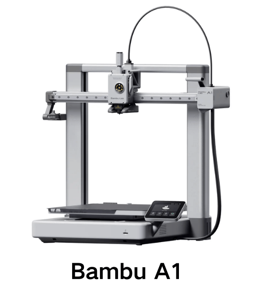
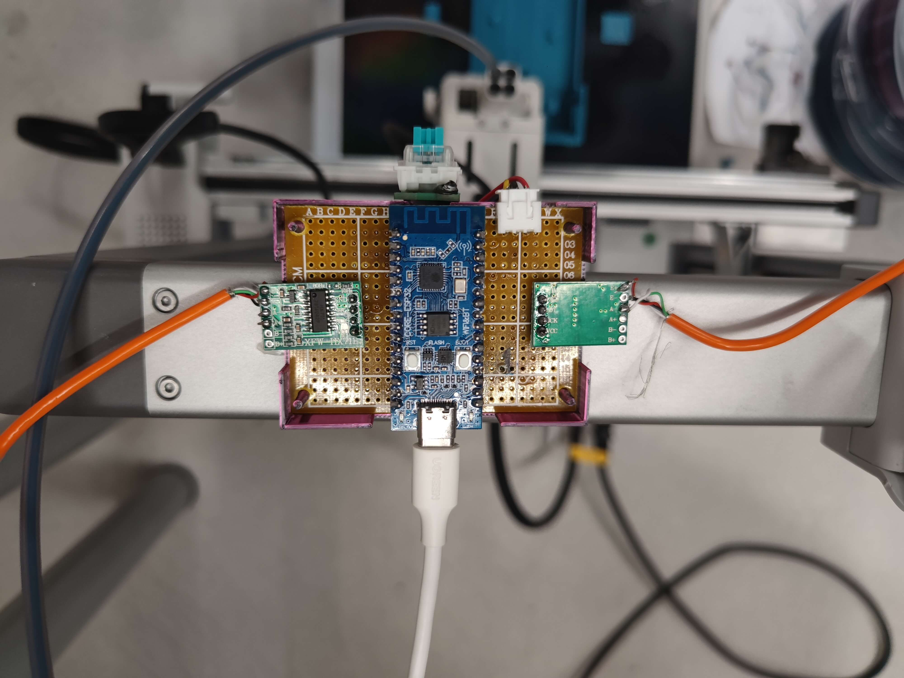
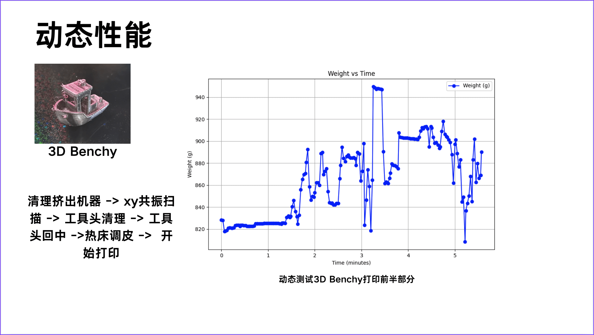
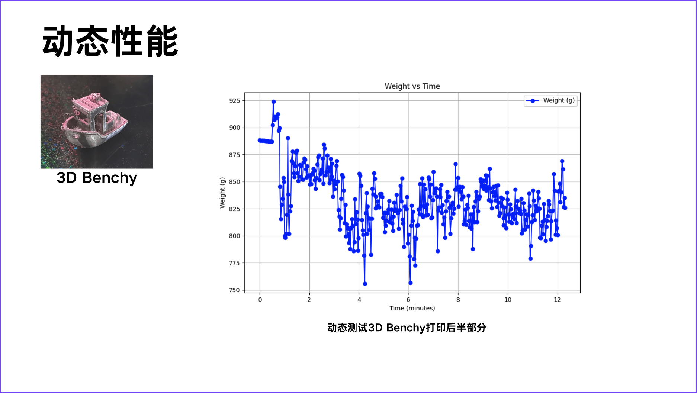

# **3D 打印耗材秤项目最终报告**
> 本项目是SDM313智能制造与设计课程的期末项目

## **1. 引言**

### **1.1 项目背景**
3D打印技术已经逐渐进入我们的日常生活，从个性化手办制作到工业零件生产，3D打印的应用场景越来越广。然而，在实际打印中，耗材不足却是常见问题，尤其是在打印大尺寸模型时，打印到一半耗材用完往往会导致整个打印失败，浪费时间和成本。

固然有AMS等解决方案，能够自动续料。但是作为课程设计项目，我们决定设计一款能够实时监测耗材重量的工具——**3D打印耗材秤**。这款耗材秤可以帮助用户随时了解剩余耗材重量，避免因耗材不足而导致打印失败，同时还能提升耗材管理的效率。


### **1.2 项目目标**
本项目旨在设计并实现一款能够实时测量耗材重量的套件，具体目标包括：
- **精确测量**：在打印过程中，实时显示耗材剩余重量，精度达到±1克。
- **不破坏打印机结构**：设计简洁，不影响拓竹A1打印机的正常使用。
- **易于安装和维护**：用户能够快速安装和拆卸，简单维护。



---

## **2. 项目设计方案**

### **2.1 设计原则**
在设计过程中，我们遵循以下设计原则：
1. **非破坏性改装**：确保不对现有打印机结构进行破坏性改动，设备可以轻松安装在打印机耗材轴上。
2. **高精度测量**：精度控制在±1克以内，满足用户需求。
3. **兼容性强**：设计适配主流3D打印机耗材轴，保持耗材正常转动。
4. **易安装与维护**：结构简单，用户可以快速完成安装或拆卸。


### **2.2 硬件设计**

#### **2.2.1 嵌入式硬件设计**
嵌入式硬件部分负责数据采集、信号处理和传输，主要包括以下组件：
- **压力传感器（2KG）**：用于测量耗材重量，将物理重量信号转换为电压信号。
- **HX711模块**：高精度24位模数转换器，用于采集压力传感器的输出信号并将其转换为数字信号。
- **ESP32-C3开发板**：作为核心微控制器，负责数据采集、处理、显示和传输。具备低功耗和丰富的通信接口，适合嵌入式开发。
- **电源管理**：通过USB接口供电，确保系统的稳定运行。



#### **2.2.2 机械硬件设计**
机械硬件部分负责固定耗材轴并提供稳定的测量平台，设计重点如下：
- **称重平台**：通过3D打印制成的托架，用于安装压力传感器并固定耗材轴，确保耗材轴能够自由旋转且传感器能够精准测量重量。
- **固定支架**：设计成可拆卸结构，便于安装到拓竹A1打印机的耗材轴上。
- **滚动支撑装置**：用于确保耗材轴的正常旋转，避免因结构干涉导致耗材卡顿。


### **2.3 软件设计**
嵌入式系统的功能实现包括以下部分：
- **标定流程**：通过按键切换系统状态，完成传感器标定。
- **数据采集与处理**：使用HX711模块采集重量数据并转换为数字信号。
- **串口通讯**：实时传输数据到上位机进行记录和分析。
- **重量显示**：通过串口传输到上位机直观显示剩余耗材重量。

### **2.4 系统框图**
以下是本项目的系统框图：

```
耗材轴 -> 压力传感器 -> HX711模块 -> ESP32-C3 -> 串口传输到上位机
```


---

## **3. 性能测试与结果分析**

### **3.1 标定流程**

标定包含三个关键点：空载（0g）、空料盘（料盘重量）和刚开封耗材（标称1000g）。通过记录每个点的传感器输出值，利用线性回归计算传感器的增益和偏移量，校准测量系统。

#### **标定步骤**
1. **空载测量**：记录空载状态下的传感器输出值，作为零点偏移量。
2. **空料盘测量**：放置空料盘，记录传感器输出值，用于计算托盘重量的影响。
3. **满载测量**：加载全新耗材（1000g），记录输出值，用于计算传感器增益。

#### **计算公式**
> TODO@maxinglong
#### **标定流程图**
 

通过该流程，系统能够实现精准重量测量。


### **3.2 静态性能**

- **测试方法**：将耗材放置在称重平台上，改变耗材在平台上的左右放置位置，记录显示的重量，同时观察长时间静态情况下的重量变化。  
- **测试结果**：
  - **重复性问题**：测试中发现，称重平台对耗材位置较为敏感，耗材放置在不同位置会导致重量测量结果出现偏差，偏差范围可达±2克，重复性较差。
    - 
  - **漂移问题**：静态情况下，5分钟内重量读数出现约2克的漂移，可能与传感器受力不均和环境温度变化有关。
    - 
  
- **结论**：静态测试的结果显示，重复性和漂移问题需要进一步优化才能满足更高精度的测量需求。


### **3.3 动态性能**

- **测试方法**：我们对系统的动态性能进行了两次测试：
  1. **打印Benchy小船模型**（20分钟）：测试系统在短时间内跟踪耗材重量变化的能力。
  2. **打印Freedorm外壳模型**（2.5小时）：测试系统在长时间打印过程中记录耗材重量变化的能力。

- **测试结果**：  
  动态测试表现非常差，系统未能准确反映耗材重量的减少趋势，数据波动严重，测量结果无法稳定：
  1. **Benchy小船测试**：打印过程中，重量数据波动剧烈，噪声范围超过±5克，几乎无法识别出耗材消耗的趋势。
     1. 
     2. 
  2. **Freedorm外壳测试**：在长时间打印中，重量数据受到持续振动干扰，测量结果噪声和漂移问题显著，无法提取出有效的耗材消耗曲线。
     1. 
     2. 

- **主要问题：振动影响**  
  动态性能差的根本原因在于打印机的振动问题：
  1. **龙门架构固有振动**：Bambu A1采用龙门架构设计，在高速打印时，龙门架构的振动特性较为显著。
  2. **耗材安装放大振动**：由于我们在设计中选择将称重系统安装在龙门架上的耗材轴处（为实现无损改装），耗材的重量进一步放大了龙门架的振动，使振动直接传导至传感器，导致数据噪声异常严重。

- **结论**：  
  系统的动态性能表现非常差，无法准确记录耗材的实时重量变化。受限于龙门架构的设计和无损改装的安装选择，振动问题成为系统动态性能的最大瓶颈。

- **改进建议**：
  1. **重新设计安装方案**：将称重系统从龙门架的耗材轴位置移除，设计一个静态安装方案，例如将耗材称重系统放置在打印机外部或低振动区域。
  2. **改进测量算法**：增加滤波算法（如低通滤波或卡尔曼滤波）来降低振动噪声对测量数据的干扰。
  3. **更换传感器**：考虑使用抗振性能更好的传感器，提升系统动态测量的能力。

### **3.4 问题分析与改进建议**

1. **重复性问题**：  
   - **问题**：机械结构设计导致传感器受力不均，壳体间的摩擦力较大，耗材放置位置不同会对重量测量结果产生影响。  
   - **改进建议**：改进托架的机械设计，确保传感器受力均匀，减少耗材放置位置的影响，同时优化传感器与称重平台的连接方式以降低摩擦力。

2. **漂移问题**：  
   - **问题**：5分钟内出现约2克的漂移，可能由传感器长期受力和环境温度变化引起。  
   - **改进建议**：采用更高稳定性的传感器，并在传感器设计中加入温度补偿功能，以减少漂移。

3. **振动问题**：  
   - **问题**：打印机的振动导致动态测量数据波动较大。  
   - **改进建议**：考虑引入IMU（惯性测量单元）闭环控制算法以对振动进行实时补偿。


通过上述优化措施，可望进一步提升系统的静态和动态性能，减少误差，提高测量的稳定性和精度。  


---

## **4. 总结与展望**

我们两个人在不到24小时内完成了整个项目的设计、制作、调试和测试。周二下午，我开始设计机械结构并进行建模，晚上完成主轴设计，第一次打印成功，小型转接件经过两次调整后最终跑通。同时，马哥着手编写ADC驱动和数码管驱动程序，顺利实现重量显示功能。随后，马哥熬夜完成了标定功能的开发。第二天下午，我们进行整机组装和测试，采集实验数据，并额外开发了一个串口上位机程序，最终完成整个项目。

整个过程较为顺利，没有遇到太大的阻碍。虽然测试数据表现还有改进空间，尤其在机械设计上仍有优化的余地，但从项目的完成度和时间安排来看，我们对成果非常满意。

---

## **附录**

1. **嵌入式实现**：嵌入式代码在[/Embedded/Code文件夹](/Embedded/Code/)下，包括传感器标定、数据采集和串口通讯等功能的实现，整体使用状态机设计。
2. **机械设计**：机械设计文件在[/Mechanic](/Mechanic/)下，包括托架、固定支架和滚动支撑装置的设计文件。原设计使用Onshape进行建模，导出STL文件进行3D打印。
3. **报告ppt**：项目前期计划书，报告ppt，最终报告在[/Report&Presentation](/Report&Presentation/)下，包括项目背景、设计方案、性能测试和结果分析等内容。
4. **测试数据**：测试数据在[/Embedded/Tests](/Embedded/Test/)下，包括静态测试和动态测试的数据记录。
